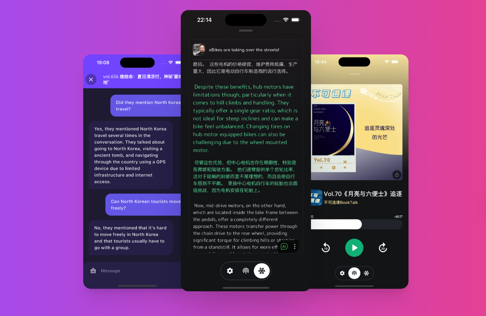
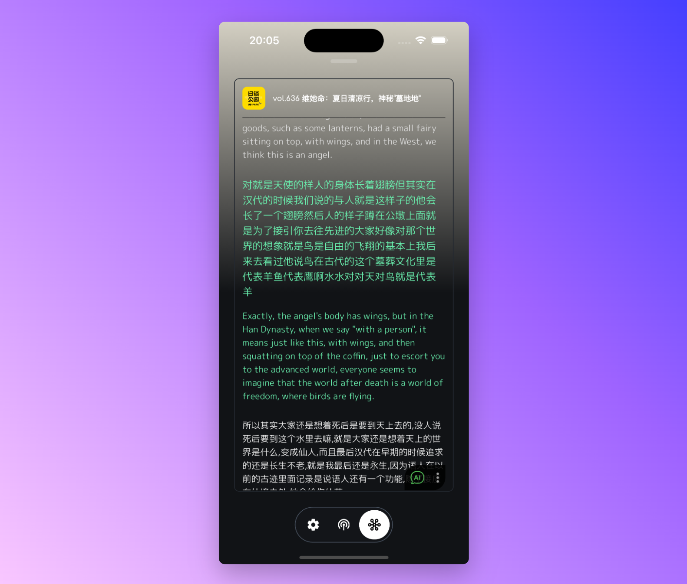
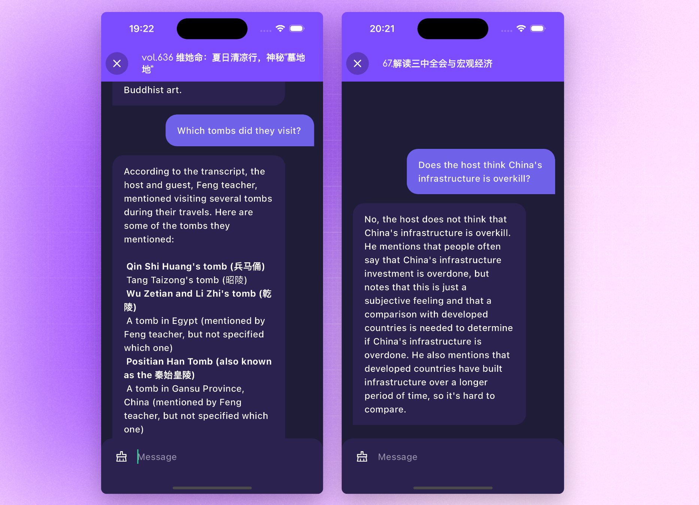
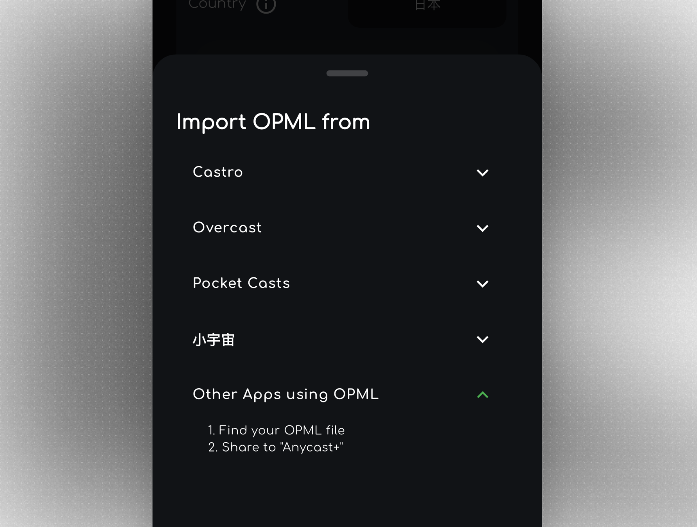
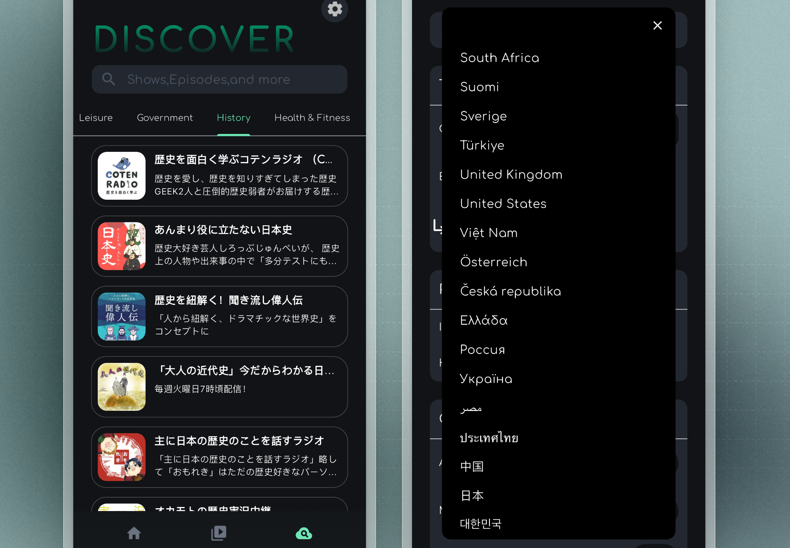

<h1 align="center" style="border-bottom: none">
    <b>
        <a href="https://anycast.website">Anycast</a> 
    </b>
    An AI-powered Podcast App 
</h1>

    Cross-platform, Seamless RSS Integration, Global Content Discovery, and AI

## Website

[https://anycast.website](https://anycast.website)

## Features
<!-- | Feature | Description | Image |
| --- | --- | --- |
| AI Transcription | AI transcribes your podcast |   -->

<table>
<tr>
<td style="width: 75%"> </td>
<td>
<b>AI Transcription</b>
 
<ul>
<li>Support 10+ languages</li>
<li>Bilingual Subtitle</li>
<li>Export to LRC</li>
</ul>
</td>
</tr>
<tr>
<td> </td>
<td>
<b>AI Chat</b>
 
Curious about this podcast? Ask it anything.
</td>
</tr>
<tr>
<td> </td>
<td>
<b>Good RSS Integration</b>
 
<ul>
<li>Subscribe to podcasts from any iTunes compatible RSS feed.</li>
<li>Import or export your subscriptions with OPML.</li>
</ul>
</td>
</tr>
<tr>
<td> </td>
<td>
<b>Access podcasts from all over the world</b>
 
<ul>
<li>Tens of countries available.</li>
<li>A variety of types of podcasts.</li>
</ul>
</td>
</tr>
</table>

## TODO

- [ ] Create different playlists
- [ ] Brand new UI design
- [ ] Support time navigation in show notes
- [ ] Support for custom ASR API and Chat API without mandatory login
- [ ] Compiler conditions for the open-source version, without requiring Firebase / RevenueCat configurations
- [ ] Carplay support
- [ ] AI recommendations
- [ ] Enhanced note-taking features

## Contributing

Conditional compilation will be supported soon, allowing you to compile with minimal (or no) extra steps.

Currently, when cloning and compiling the project, the following additional files are required:

- `.env`
- `android/app/google-services.json`
- `android/key.properties`
- `ios/Runner/GoogleService-Info.plist`
- `lib/firebase_options.dart`

## License

Anycast is licensed under the MIT License - see the [LICENSE](LICENSE) file for details.
