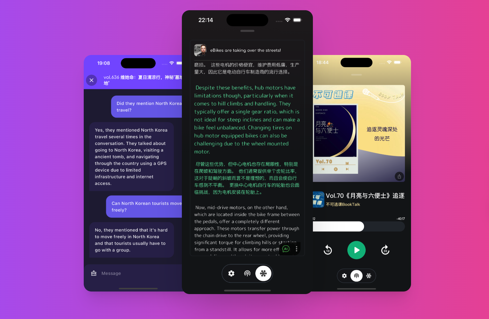
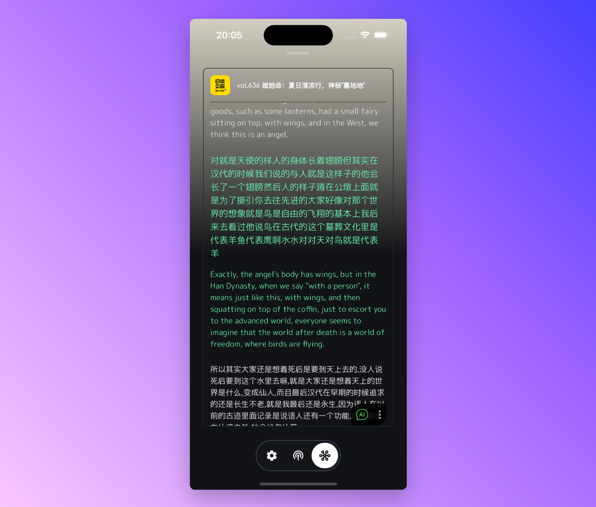
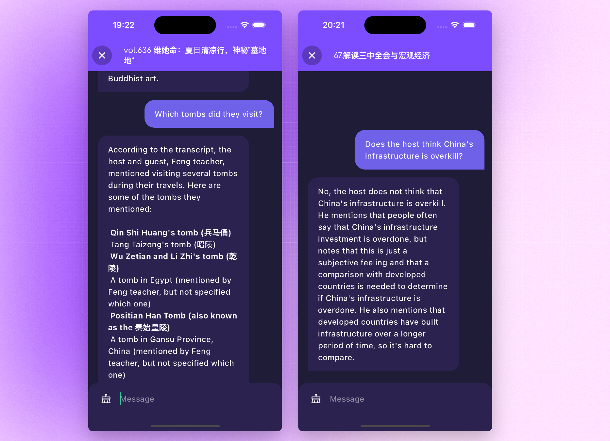
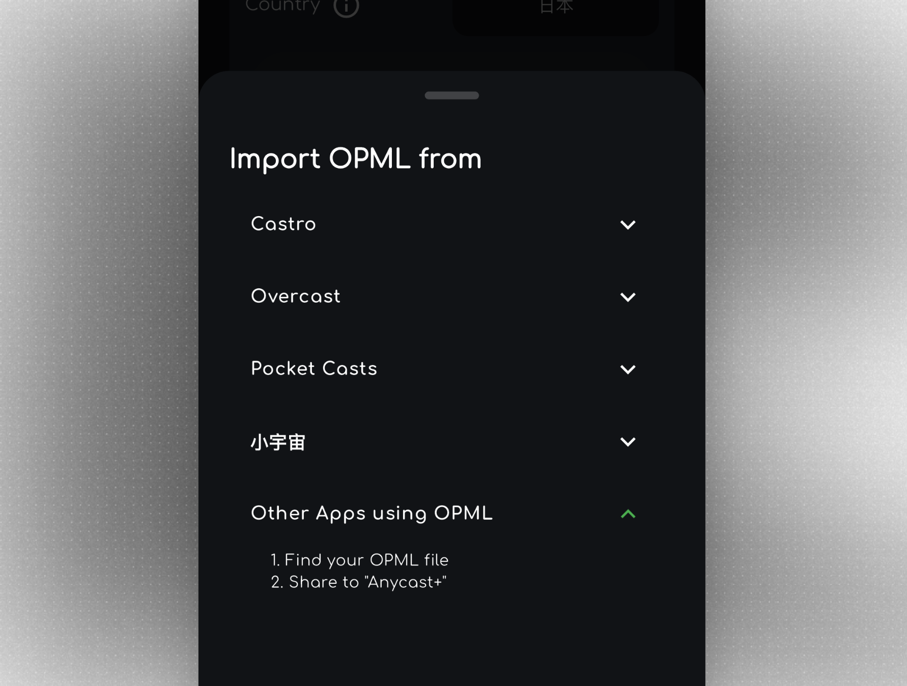
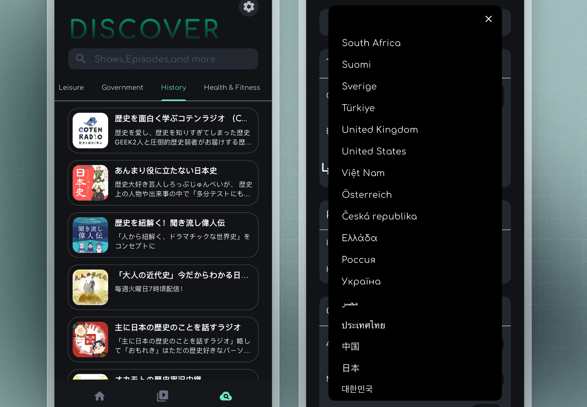

<h1 align="center" style="border-bottom: none">
    <b>
        <a href="https://anycast.website">Anycast</a><br>
    </b>
    An AI-powered Podcast App<br>
</h1>

<p align="center">
    Cross-platform, Seamless RSS Integration, Global Content Discovery, and AI
</p>

<p align="center">
<a href="https://apps.apple.com/hk/app/anycast/id6499069246">

</a>
<a href="https://groups.google.com/g/anycastplus/c/MW2VDoMNWQU">

</a>
<a href="https://www.producthunt.com/posts/anycast?embed=true&utm_source=badge-featured&utm_medium=badge&utm_souce=badge-anycast">

</a>
<a href="https://t.me/+GlVRhl1nEVk2MmNl">

</a>
</p>

<p align="center">

</p>

## Website

[https://anycast.website](https://anycast.website)

## Features
<!-- | Feature | Description | Image |
| --- | --- | --- |
| AI Transcription | AI transcribes your podcast |   -->

<table>
<tr>
<td style="width: 75%"> </td>
<td>
<b>AI Transcription</b>
<br>
<ul>
<li>Support 10+ languages</li>
<li>Bilingual Subtitle</li>
<li>Export to LRC</li>
</ul>
</td>
</tr>
<tr>
<td> </td>
<td>
<b>AI Chat</b>
<br>
Curious about this podcast? Ask it anything.
</td>
</tr>
<tr>
<td> </td>
<td>
<b>Good RSS Integration</b>
<br>
<ul>
<li>Subscribe to podcasts from any iTunes compatible RSS feed.</li>
<li>Import or export your subscriptions with OPML.</li>
</ul>
</td>
</tr>
<tr>
<td> </td>
<td>
<b>Access podcasts from all over the world</b>
<br>
<ul>
<li>Tens of countries available.</li>
<li>A variety of types of podcasts.</li>
</ul>
</td>
</tr>
</table>

## TODO

- [ ] Create different playlists
- [ ] Brand new UI design
- [ ] Support time navigation in show notes
- [ ] Support for custom ASR API and Chat API without mandatory login
- [ ] Compiler conditions for the open-source version, without requiring Firebase / RevenueCat configurations
- [ ] Carplay support
- [ ] AI recommendations
- [ ] Enhanced note-taking features

## Contributing

Conditional compilation will be supported soon, allowing you to compile with minimal (or no) extra steps.

Currently, when cloning and compiling the project, the following additional files are required:

- `.env`
- `android/app/google-services.json`
- `ios/Runner/GoogleService-Info.plist`
- `lib/firebase_options.dart`

`android/key.properties` and the upload keystore are only required for signed
Android release builds.

Maintainers with access to the Anycast Infisical project can generate the
development configuration without sharing these files directly:

```shell
brew install infisical/get-cli/infisical
infisical login
./scripts/bootstrap.sh
```

For a personal-team iPhone visual preview that does not change repository or
release signing settings, follow
[iOS personal-team device preview](docs/ios-physical-device-preview.md).

The bootstrap script writes the ignored files locally with restrictive
permissions. It also verifies the generated client configuration against
reviewed SHA-256 digests, so an Infisical value change requires a corresponding
Git review without committing the value itself. Android and iOS
release-signing material is managed separately by the protected release
workflow.

The Infisical project slug is `anycast`. Both `dev` and `release` contain
`/app-config`; release-only material is split into `/android-signing`,
`/ios-signing`, and `/app-store-connect`. Secret names are referenced by the
scripts and workflows in this repository, while their values remain in
Infisical.

### Store candidates and releases

Pull requests run analysis, tests, an Android release build signed with a
temporary CI key, and an unsigned iOS release build. These checks use synthetic
client configuration and never access release credentials. Maintainers can
also run the same checks manually for a selected branch from GitHub Actions.

Store candidates are built on GitHub-hosted runners and uploaded directly to
Google Play Internal testing and TestFlight. GitHub does not retain the AAB or
IPA as a workflow artifact.

Use a short-lived branch and pull request for every change to `main`. External
contributors can continue to participate through issues and pull requests
without repository write access. Only the maintainers with write access should
create candidate and release tags.

1. Merge the changes that belong in the next candidate into `main`.
2. Update `version` in `pubspec.yaml` as `major.minor.patch+build`, and merge
   that change into `main`.
3. Tag that commit with the exact same candidate version:

   ```shell
   git switch main
   git pull --ff-only
   git tag rc-1.2.2+39
   git push origin rc-1.2.2+39
   ```

4. Follow the `Store candidate` workflow in GitHub Actions, then wait for
   store-side processing to finish.
5. Test the candidate. If it passes, promote the same builds in Google Play and
   App Store Connect instead of rebuilding them. A final source tag can then be
   added to the same commit without triggering another build:

   ```shell
   git tag v1.2.2
   git push origin v1.2.2
   ```

Creating an `rc-*` tag performs real store uploads; it is not a CI dry run. If
one platform uploads successfully and the other fails, use **Re-run failed
jobs** instead of rerunning every job, because stores reject duplicate build
numbers. TestFlight and Play Internal are testing destinations and do not
promote a release to production automatically.

Candidate and release tags cannot be moved or deleted. If a candidate fails,
increase the build number and create a new `rc-*` tag.

The workflow rejects a mismatched version or a commit outside `main`. Its
short-lived GitHub OIDC identity can authenticate only from the trusted
reusable workflow on `main`, running for a candidate tag in the `release`
environment; no Infisical client secret or Google service-account key is stored
in GitHub. The free-tier built-in Infisical viewer role is project-scoped, so
keep this project limited to Anycast secrets.

The current Apple Distribution certificate and provisioning profiles expire on
2026-12-11. Rotate them before that date, replace the values in Infisical
`release /ios-signing`, and update the reviewed certificate/profile identifiers
in the repository in the same pull request. The release workflow intentionally
fails closed if those values drift.

## License

Anycast is licensed under the MIT License - see the [LICENSE](LICENSE) file for details.
